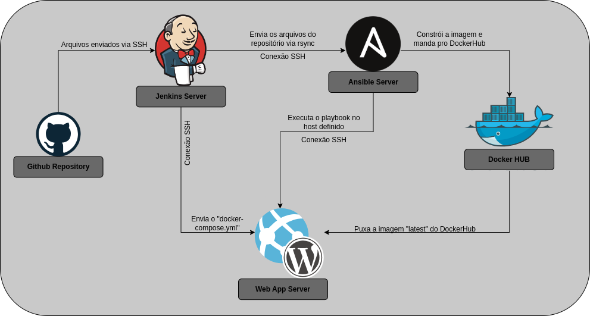

# Projeto de DevOps e CI/CD com Git, Jenkins, Ansible e Docker. :whale:	

- Este repositório contém a implementação de um pipeline de DevOps CI/CD, construído com as tecnologias Jenkins, Ansible, e Docker. Ele automatiza o processo de deploy de uma aplicação, desde a obtenção de arquivos do repositório até a criação de containers Docker a partir de imagens customizadas. As principais aplicações que são construídas são Bookstack e Mariadb, mas o projeto é flexível para acomodar qualquer aplicação. O processo engloba a conexão com um servidor Jenkins que adquire todos os arquivos e os envia via rsync para um servidor Ansible, onde são criadas duas imagens Docker. Após enviar as imagens para o DockerHub, um playbook é executado para criar os containers no servidor de aplicação utilizando 'docker-compose up'.

- **Esse "README.md" não é a documentação completa desse projeto, clique nesse [link](https://EduardoVasconceloss.github.io/devops-ci-cd-project/) para ver a documentação completa.**

- Para fins de melhor compreensão do projeto, veja esse diagrama:
  

