# Configurando o Jenkins

- Após instalar o Jenkins, é necessário configurá-lo pelo navegador.

## Acesse a aplicação do Jenkins

Digite o IP do servidor do Jenkins no seu navegador de preferência.

- Exemplo: `<http://ip-do-server-jenkins:8080>`.

## "Destrave" o Jenkins

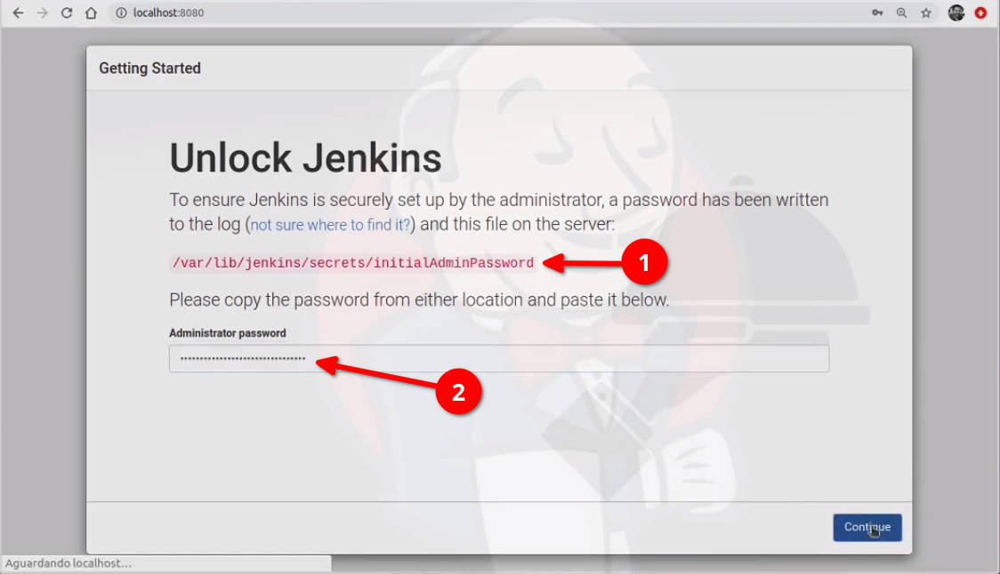

- **1° passo:** Copie o caminho e cole no seu terminal para ter acesso a senha, Exemplo: `cat /var/lib/jenkins/secrets/initialAdminPassword`

- **2° passo:** Copie a senha que foi mostrada no seu terminal e cole no campo "Administrator password".

## Customize o Jenkins

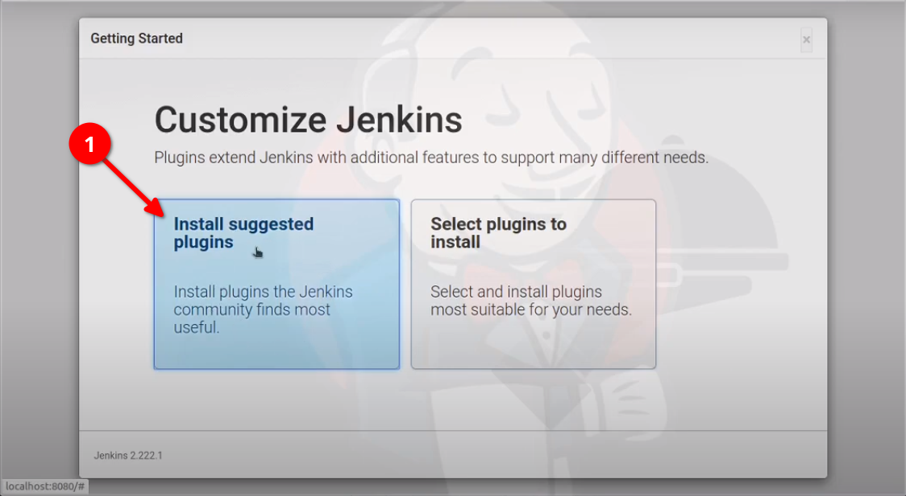

- Clique em "Install suggested plugins" para a instalar alguns plugins básicos e recomendados pelo Jenkins.

## Criando um Admin User para o Jenkins

Para acessar e configurar o Jenkins, é necessário criar um usuário com as permissões de um Administrador.

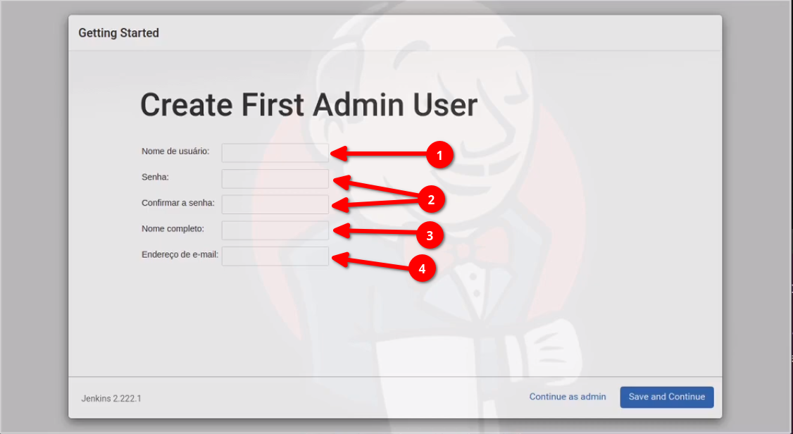

- **1° passo:** Digite seu nome de usuário.

- **2° passo:** Digite sua senha e confirme ela no campo abaixo.

- **3° passo:** Digite seu nome completo.

- **4° passo:** Digite seu endereço de e-mail.

## Gerenciando o Jenkins

Agora, iremos começar a etapa inicial de gerenciamento. É preciso gerenciar o Jenkins para que ele possa usar as ferramentas e plugins necessários.

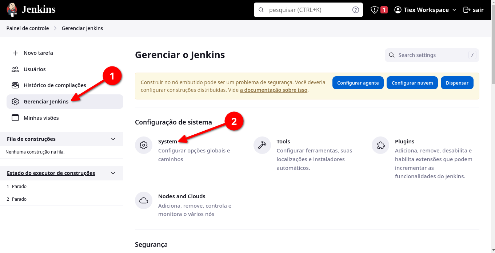

- **1° passo:** No canto esquerdo, clique em "Gerenciar jenkins".

- **2°passo:** Na seção de "Configuração do sistema" você deve achar e clicar na opção "System".

### Adicionando os servidores

Para que o Jenkins possa ter conexão com os servidores que nós vamos utilizar, é preciso adicionar cada servidor ao sistema do Jenkins.

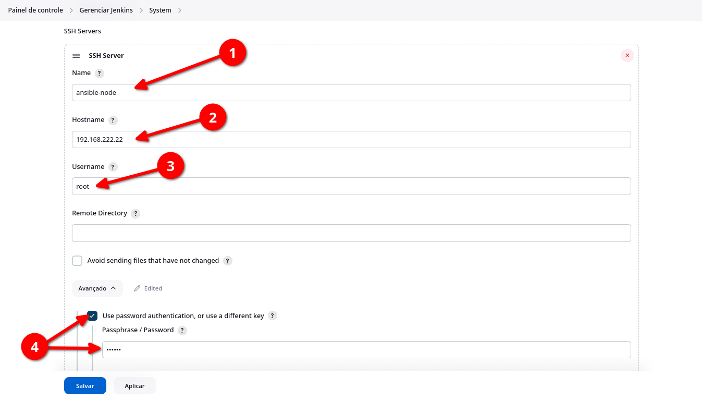

- **1° passo:** Dentro da seção "System", você deve procurar a sub-seção chamada "SSH Servers", após ter achado a sub-seção, digite o nome do seu servidor no campo **"Name"**.

- **2° passo:** Digite o **IP** do seu servidor no campo **"Hostname"** para que o Jenkins possa acessar o servidor via SSH.

- **3° passo:** No campo "Username", digite o usuário que o Jenkins irá utilizar para logar no servidor. No nosso caso, iremos utilizar o usuário **"root"**.

- **4° passo:** Clique na opção **"Avançado"**, marque a caixa **"Use password authentication, or use a different key"**. Após isso, digite a senha de acesso para o usuário **"root"** do seu servidor.

Por fim, precisamos adicionar os outros dois servidores (jenkins-node e webapp-node). Para isso, clique na opção **"Adicionar"** e repita os **três primeiros passos**, alterando as informações para seus respectivos servidores.

> **Observação:** Você pode testar a conexão do Jenkins com os servidores. Basta clicar na opção **"Test Configuration"** após ter seguido os **três primeiros passos** acima.

### Gerenciando os plugins

No Jenkins, é possível adicionar plugins para facilitar a utilização de algumas ferramentas. No nosso caso, iremos adicioanr um plugin relacionado ao SSH.

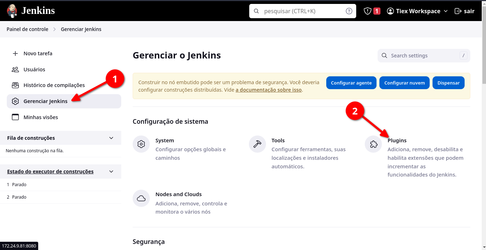

- **1° passo:** Na página inicial do Jenkins, você deve clicar em **"Gerenciar Jenkins"**.

- **2° passo:** Agora clique em **"Plugins"** para visualizar os plugins que o Jenkins disponibiliza para uso.

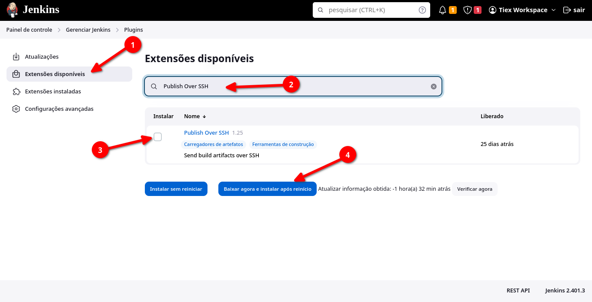

- **1° passo:** Clique em **"Extensões disponíveis"**.

- **2° passo:** Digite **"Publish Over SSH"** para encontrar o plugin necessário.

- **3° passo:** Marque o campo para instalar o plugin.

- **4° passo:** Clique em **"Baixar agora e instalar após reinício"**.

> **Nota:** É necessário reiniciar o Jenkins após a instalação do plugin.

### Criando uma tarefa

Uma tarefa serve para automatizar uma série de etapas em um pipeline de CI/CD. Essas etapas incluem o checkout do código de um repositório git, a compilação do código, a execução de testes automatizados e etc.


- **1° passo:** No **"Painel de controle"** do Jenkins, clique em **"Nova tarefa"**.

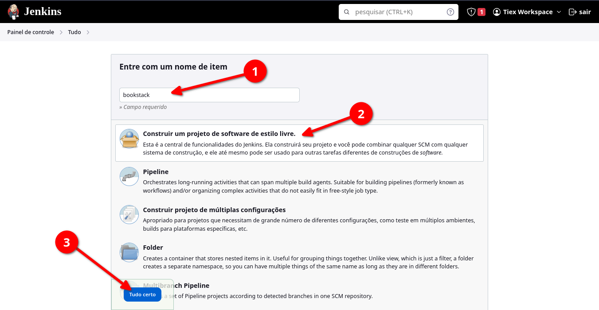

- **1° passo:** Escolha um nome para sua tarefa. Como esse projeto tem o intuito de fazer o deploy do Bookstack, eu escolhi o nome **"bookstack"** para a tarefa.

- **2° passo:** Selecione o campo **"Construir um projeto de software de estilo livre."**

- **3° passo:** Por fim, clique na opção **"Tudo certo"**.

### Configurando a tarefa

Após criar a tarefa, falta configurará-la.

---

#### Adicionando o código fonte

Vamos adicionar os nossos arquivos necessários para o deploy do Bookstack ao Jenkins via Git.

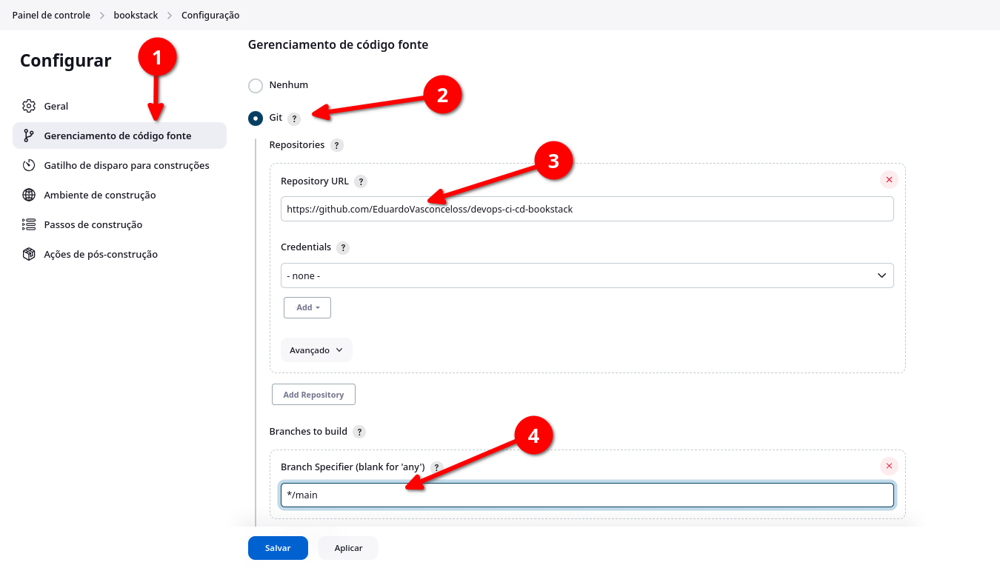

- **1° passo:** Clique no campo **"Gerenciamento de código fonte"**.

- **2° passo:** Marque o campo **"Git"**.

- **3° passo:** Cole o link do seu repositório do github.

- **4° passo:** Selecione a branch do seu repositório, no meu caso é a **"main"**.

---

#### Enviando o código-fonte para os servidores.

Os "passos de construção" em uma tarefa do Jenkins são comandos ou scripts que são executados para realizar uma parte específica do processo de construção ou implantação. Eles são a parte central de uma tarefa do Jenkins, pois definem as ações que devem ser executadas quando a tarefa é executada.

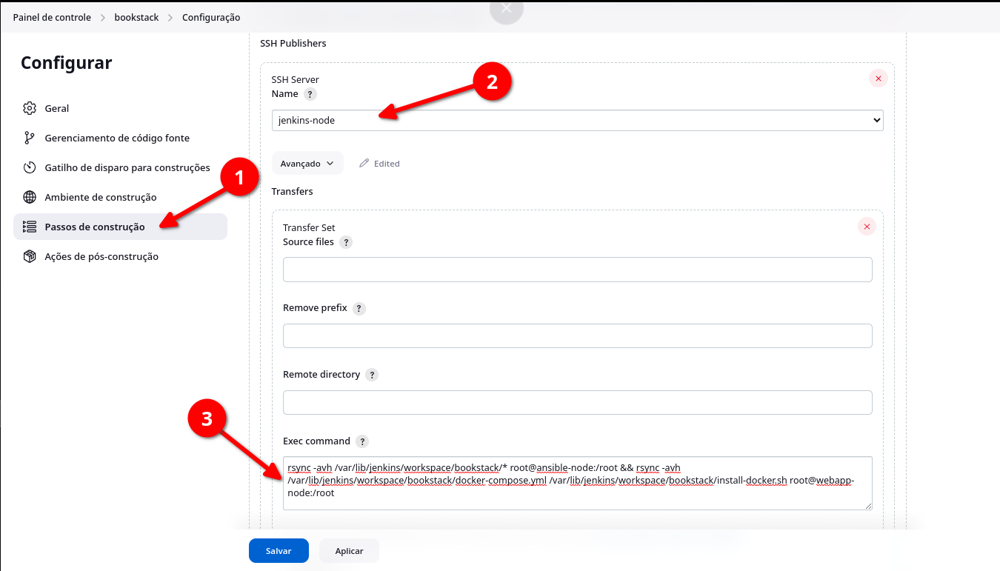

- **1° passo:** Clique na seção **"Passos de construção"** e procure a sub-seção chamada **"SSH Publishers"**.

- **2° passo:** Selecione o servidor onde o passo de construção será executado, no momento, vamos escolher o **"jenkins-node"**.

- **3° passo:** No campo **"Exec command"**, cole os seguintes comandos:

```bash
rsync -avh /var/lib/jenkins/workspace/bookstack/* root@ansible-node:/root && rsync -avh /var/lib/jenkins/workspace/bookstack/docker-compose.yml root@webapp-node:/root
```

Agora é só clicar em **"Aplicar"** e depois clique em **"Salvar"**.

- **3.1° passo:** É preciso "Construir" a nossa tarefa para que ela seja executada.

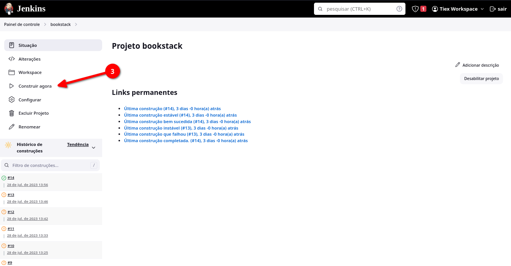

> **Nota:** No **3° passo**, estamos enviando os arquivos do nosso repositório git para o diretório **"/root"** do servidor **"ansible-node"** e também estamos enviando os arquivos "docker-compose.yml" para o diretório **"/root"** do servidor **"webapp-node"**.

---

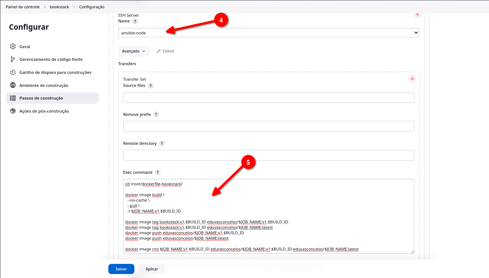

- **4° passo:** Adicione mais um passo de construção e selecione o servidor **"ansible-node"**.

- **5° passo:** No campo **"Exec command"**, cole os seguintes comandos:

```bash
cd /root
ansible-playbook -vvv ansible-deploy.yml
```

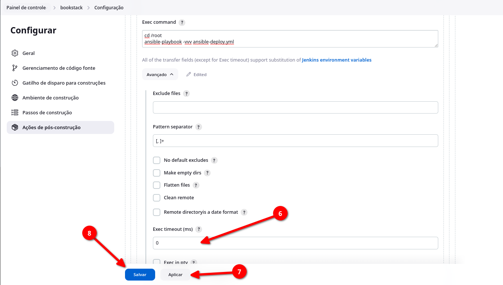

- **6° passo:** No campo **"Exec timeout (ms)"**, mude o valor para **"0"**.

- **7° passo:** Aplique as alterações feitas.

- **8° passo:** Por fim, basta salvar sua tarefa.

---

### Constuindo a tarefa criada

Depois de tudo estar configurado, é hora de fazer a mágica acontercer, precisamos construir a tarefa "bookstack".

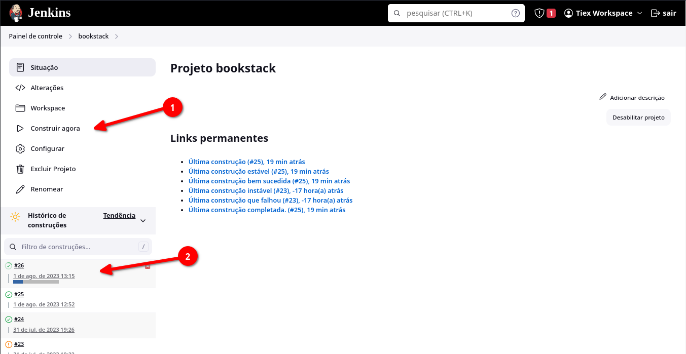

- **1° Passo:** Clique em **"Construir agora"** para começar a construção da tarefa.

- **2° Passo:** Perceba que a sua construção vai aparecer no canto inferior esquerdo. Clique no ícone que aparece à esquerda da "numeração" da sua tarefa.

Após realizar esses dois passos, você irá ver os logs da construção da sua tarefa.

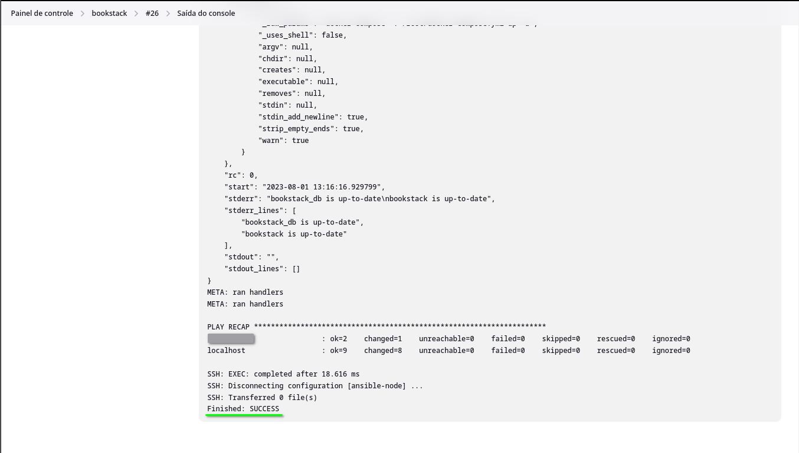

Se tudo correr bem, você vai ver a saída **"Finished: SUCCESS"**, isso quer dizer que a construção da tarefa foi finalizada e não foram encontrados erros durante o processo.
